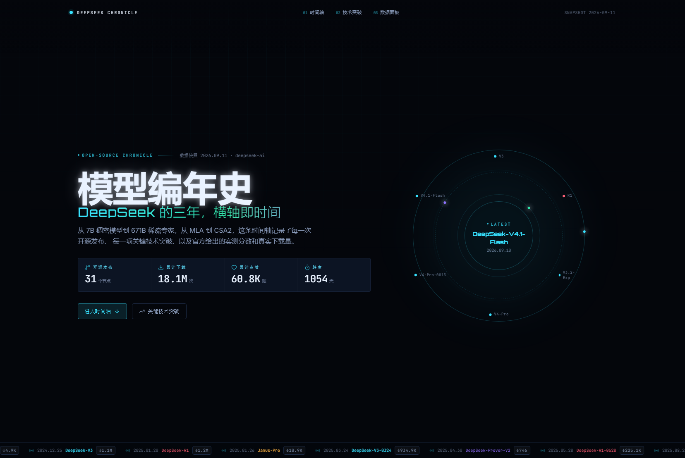
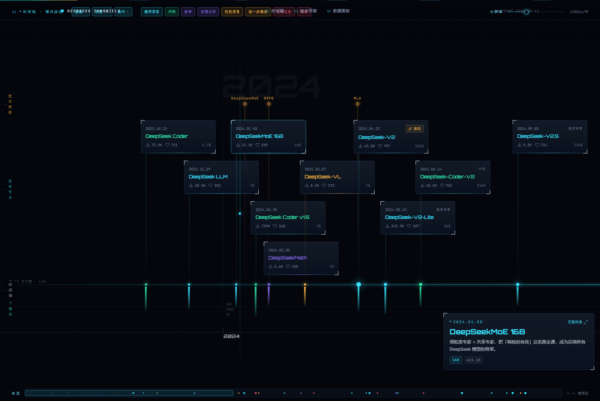
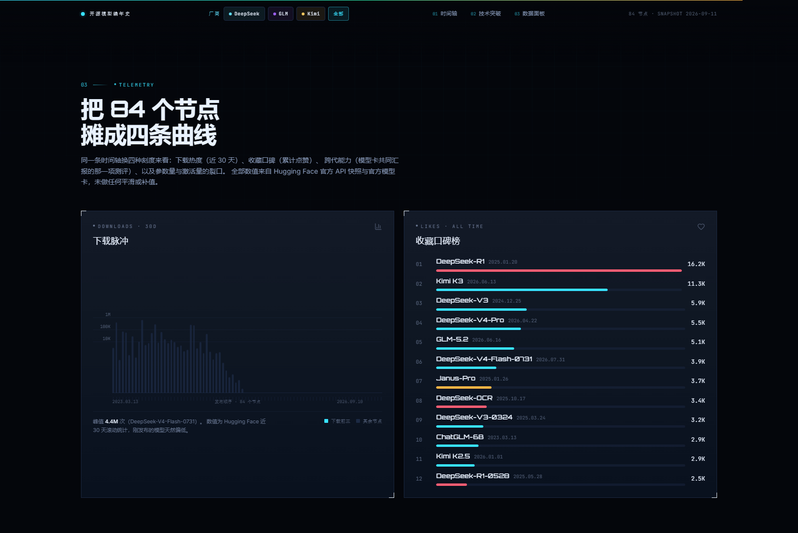
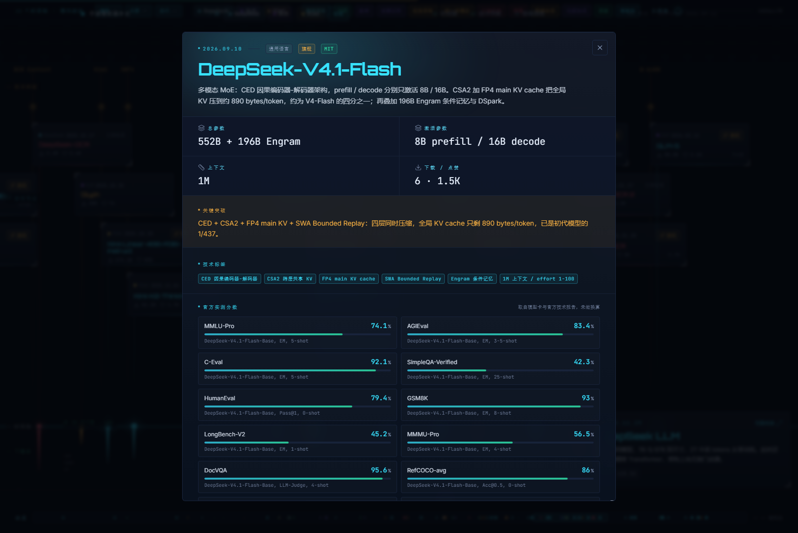

# 模型编年史 · Model Chronicle

把一家实验室的开源发布史摊在一条**横轴**上：发布日期、关键突破技术、官方测评分数、参数量、下载量与仓库体积，全部来自 Hugging Face 官方 API 快照与官方模型卡。

现在收录三家：**DeepSeek**（2023.10 → 2026.09）、**智谱 GLM**（2023.03 → 2026.08）、**月之暗面 Kimi**（2025.02 → 2026.06），合计 **84 个发布节点、68 项技术突破**，顶部可按厂商切换或三卷并看。

在线预览：<https://model-chronicle.weidows.tech/>（GitHub Pages + 自定义域；`weidows.github.io/model-chronicle/` 与 `blog.weidows.tech/model-chronicle/` 均会 301 到同一地址）






## 它长什么样

- **星图式滚动时间轴**：竖向滚动驱动横向平移，时间轴是一条发光光束，节点是带轨道的球；
  上方是发布卡片（按时间自动错行排布，永不重叠），下方是对数刻度的下载量光柱。
- **聚焦读数**：视口中心的播放头会自动锁定最近的版本，右下角 HUD 实时显示该版本的
  参数、上下文、下载量、突破点与标签，点“完整档案”展开全部评测分数。
- **技术突破轨**：24 项关键技术（MLA、GRPO、FP8、MTP、DSA、CED、CSA2、FP4 KV、DSpark…）
  以琥珀色菱形钉在同一根时间轴上，独立成区还有甘特条展示“从提出沿用至今”。
- **数据面板**：下载脉冲（对数柱 + 网格刻度）、收藏口碑榜、跨代能力曲线（模型卡共同汇报的
  同一项 benchmark）、参数量阶梯（总参数量实心、激活量中心缺口）。

动效全部走 `motion`（framer-motion 后继），并遵守 `prefers-reduced-motion`。

## 技术栈

| 层 | 选择 |
| --- | --- |
| 框架 | React 19 + TypeScript + Vite |
| 样式 | Tailwind CSS v4（`@theme` token + `@utility` HUD 原语，无 UI 框架皮肤） |
| 交互原语 | Radix UI（Dialog / Tabs / Slider / Tooltip，无样式，全部自定义外观） |
| 动效 | motion（滚动驱动平移、入场编排、路径绘线、数字滚动） |
| 图标 / 字体 | lucide-react；Orbitron + Inter Variable + JetBrains Mono（自托管） |

## 本地开发

```bash
npm install
npm run dev          # http://localhost:5173
npm run build        # 产物在 dist/
npm run preview      # 预览构建产物
```

## 数据从哪来

三个实验室的公开权重，**没有一条编造或补值**：

1. `https://huggingface.co/api/models?author=<org>` 组织列表（DeepSeek 105 / zai-org 154 / moonshotai 19 个仓库）
   与逐仓库详情 → `downloads`（**近 30 天滚动**）、`likes`（累计）、`createdAt`、`usedStorage`
2. 各仓库模型卡 README → 参数量、激活量、上下文、许可协议、官方评测分数

```bash
python scripts/fetch_raw.py      # DeepSeek：原始数据 → scripts/raw/
python scripts/gen_data.py       # DeepSeek：合并策展层 → src/data/deepseek.ts
python scripts/fetch_family.py   # GLM / Kimi：原始数据 → scripts/raw/<org>/（需本机代理）
python scripts/gen_orgs.py       # GLM / Kimi：抽取结果 → src/data/{zai,kimi}.ts + src/data/index.ts
```

- DeepSeek 那一路（`gen_data.py`）有两块**人工策展**：`OVERLAY`（中文摘要、突破点、家族/分级、benchmark 取舍）
  与 `LABELS`（模型卡没写、只存在于论文或兄弟仓库的参数与许可）。数值一律从原始数据读，策展只负责措辞与归类。
- GLM / Kimi 那一路（`gen_orgs.py`）是机械转换：模型卡读数 → 结构化字段，家族/分级/泳道来自脚本里的显式映射表，
  事实由 `scripts/raw/<org>/extract.json` 承载，可逐条回模型卡复算。
- 模型卡未标注的字段一律 `null`，页面显示“未公开 / 未标注”，不做推测。DeepSeek 侧唯一例外是 **8 个节点**
  （V2.5、VL2、Janus-Pro、V3-0324、R1-0528、V3.1-Terminus、V3.2-Exp、Math-V2）的参数量：
  它们按同代基座推定，档案里会明确打出**“家族推定”**标记并附说明，不会冒充模型卡原文。
- 下载量口径：HF 报告的是**滚动 30 天**，刚发布的模型天然偏低，因此另设累计点赞榜做长期热度参照。

## 目录结构

```
src/
  data/deepseek.ts      DeepSeek 数据（生成，勿手改）
  data/zai.ts           GLM 数据（生成，勿手改）
  data/kimi.ts          Kimi 数据（生成，勿手改）
  data/index.ts         家族注册表 + 合并视图（生成，勿手改）
  data/types.ts         Dataset / Release / Breakthrough 类型
  components/
    Starfield.tsx       分层星野 canvas（视差 + 闪烁）
    Hero.tsx            头部：口径说明 + KPI + 轨道图
    Timeline.tsx        时间轴引擎（滚动驱动平移、错行排布、聚焦读数、全览条、缩放）
    TechRibbon.tsx      技术突破轨（按泳道筛选 + 甘特条）
    Analytics.tsx       数据面板装配
    charts/             四个独立图表（对数柱 / 榜单 / 曲线 / 阶梯）
    ui/primitives.tsx   HUD 原语（面板、角标、标签、数字滚动）
scripts/                fetch + generate（可重跑）
```

## 部署

**GitHub Pages + 自定义域**（当前线上 <https://model-chronicle.weidows.tech/>）：
`.github/workflows/deploy.yml` 在 `main` 推送时用 `VITE_BASE=/` 构建（自定义域把站点伺服在域名根），
`public/CNAME` 与仓库 Pages 设置里的 `cname` 都指向该域名。

绑域全过程（`gh` + `cfcli`，可复现）：

```bash
# 1. DNS：灰云（DNS-only）CNAME 指到 GitHub Pages，不能开 CF 代理，否则签不出证书
cfcli -d weidows.tech add -t CNAME -l 1 model-chronicle weidows.github.io
# 2. Pages 侧写入自定义域（PUT 返回 204 无正文）
gh api --method PUT repos/Weidows/model-chronicle/pages -f cname=model-chronicle.weidows.tech
# 3. DNS 校验通过（protected_domain_state=verified）+ 证书签发后，再强制 HTTPS
gh api --method PUT repos/Weidows/model-chronicle/pages -F https_enforced=true
```

`cfcli` 的凭据来自 `~/.cfcli.yml`（`cfcli zones` 可自检）；`wrangler` 只在改用 CF Pages 托管时才需要。

**Cloudflare Pages**（可选）：项目根目录 `base` 走 `VITE_BASE` 环境变量，根域名部署直接用默认值：

```bash
npm run build && npx wrangler pages deploy dist --project-name model-chronicle
```

## 免责声明

非官方整理，与 DeepSeek 无隶属关系。数据快照时间见页面顶部与页脚（当前 2026-09-11）。
模型权重与评测口径的最终解释权归发布方所有。
